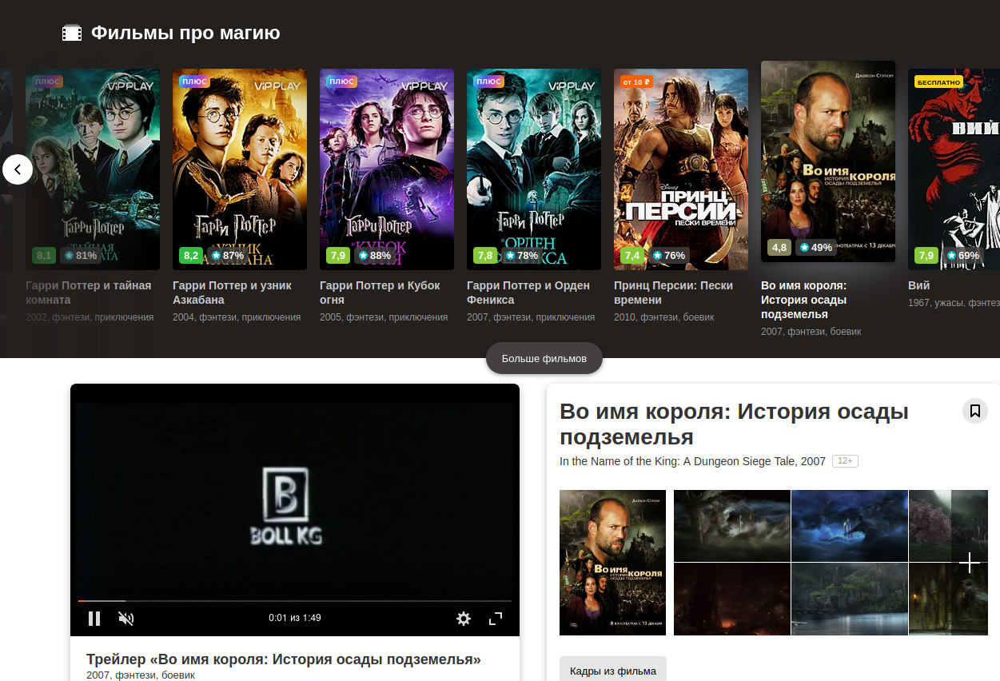
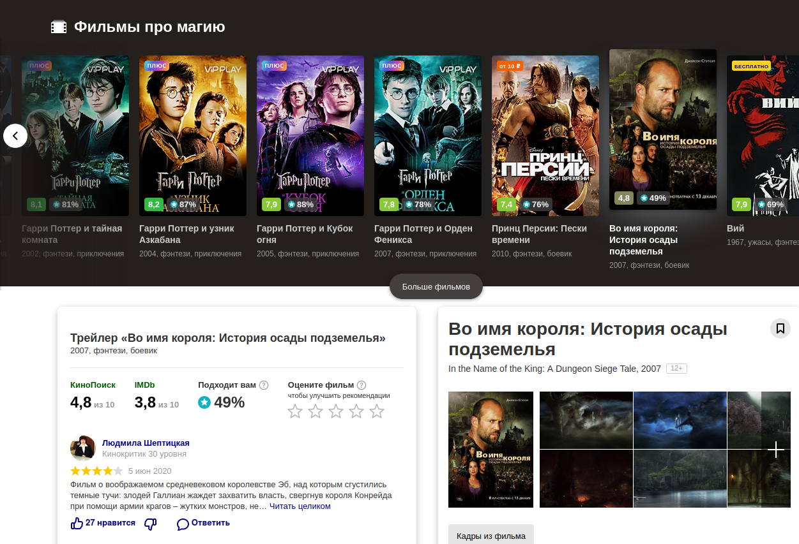
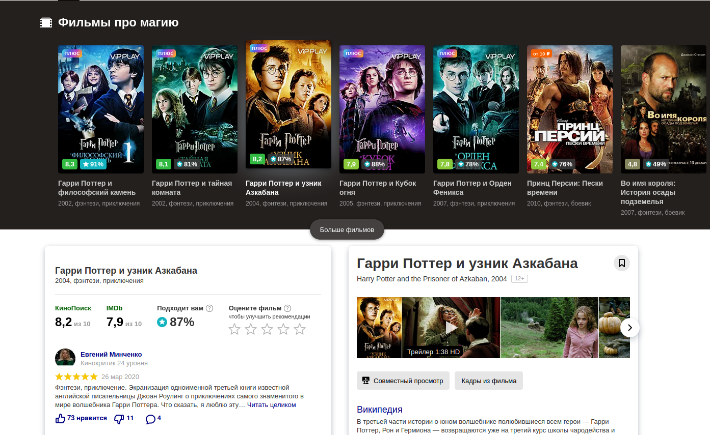

# RVP2-YVC

__Delete the video player for the trailer or remove the movie poster from the yandex video collection when searching for a movie.__
__Increases the page loading speed accordingly. You watch the movie by clicking on the link, and this player also plays for itself. Do you need it ? :)__

* Option with auto-play of the trailer, before and after triggering.

 

* A variant with an advertising poster, before and after triggering.

 

~~p. s to install an unsigned RVP2-YVC.xpi~~  
* __enter__: about:config  
* __find__: xpinstall.signatures.required  
* __replace__: true on file  
